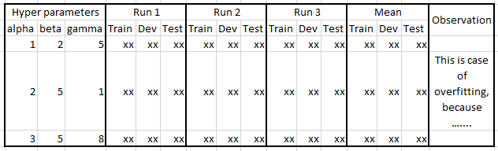
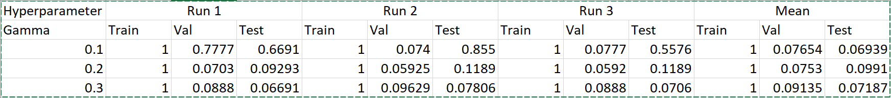

# MLOps-Task-1

## Final Exam

### Q1

Output a table like below, for a classifier of your choice, create `70:15:15` `train:test:dev` splits three times, vary the hyper parameters, run experiments, report metrics. Do you see variations among these runs, why or why not? Identify and report bad hyper parameters leading to over-fitting. Identify what are good hyper parameters. Comment about interpretation of hyperparameter values and performance. Commit the code to the git repo, and upload the screenshot of your result table as shown in the example below. Any further comments, write in the `README.md`.



### A1

Run code with this command,
```
python -m mlops_task_1.final_exam.q1
```

Here we see that the `SVM` model overfits for all gamma values from `0.1` to `0.5`. This is apparent from the fact that the model shows `100%` accuracy in every run on the train set but the mean accuracy on the validation and test set is very poor.

> Note that this image shows only accuracy values of some gamma values. The full data is shown in the output below.



#### Output

```
(/mnt/c/Users/jaide/Desktop/New_folder/MLOps-Task-1/.venv) jaideep@JD-GPC:/mnt/c/Users/jaide/Desktop/New_folder/MLOps-Task-1$ python -m mlops_task_1.final_exam.q1
Original image size: (1797, 8, 8)
Classifier: <class 'sklearn.svm._classes.SVC'>
100%|███████████████████████████████████████████████████████████████████████████████████████████████████████████████████████| 3/3 [00:01<00:00,  2.83it/s]
100%|███████████████████████████████████████████████████████████████████████████████████████████████████████████████████████| 3/3 [00:01<00:00,  2.73it/s]
100%|███████████████████████████████████████████████████████████████████████████████████████████████████████████████████████| 3/3 [00:01<00:00,  2.36it/s]
100%|███████████████████████████████████████████████████████████████████████████████████████████████████████████████████████| 3/3 [00:01<00:00,  2.67it/s]
100%|███████████████████████████████████████████████████████████████████████████████████████████████████████████████████████| 3/3 [00:01<00:00,  2.96it/s]
5it [00:05,  1.11s/it]██████████████████████████████████████████████████████████████████████████████████████████████████████| 3/3 [00:01<00:00,  2.96it/s]
[
    {
        "hparams": {
            "gamma": 0.1
        },
        "mean_metrics": {
            "test/acc": 0.06939281288723669,
            "test/f1": 0.012953452982064342,
            "train/acc": 1.0,
            "train/f1": 1.0,
            "valid/acc": 0.07654320987654321,
            "valid/f1": 0.014219694276573054
        },
        "metrics": [
            {
                "test": {
                    "acc": 0.06691449814126393,
                    "f1": 0.012543554006968641
                },
                "train": {
                    "acc": 1.0,
                    "f1": 1.0
                },
                "valid": {
                    "acc": 0.07777777777777778,
                    "f1": 0.01443298969072165
                }
            },
            {
                "test": {
                    "acc": 0.08550185873605948,
                    "f1": 0.015753424657534244
                },
                "train": {
                    "acc": 1.0,
                    "f1": 1.0
                },
                "valid": {
                    "acc": 0.07407407407407407,
                    "f1": 0.013793103448275862
                }
            },
            {
                "test": {
                    "acc": 0.055762081784386616,
                    "f1": 0.01056338028169014
                },
                "train": {
                    "acc": 1.0,
                    "f1": 1.0
                },
                "valid": {
                    "acc": 0.07777777777777778,
                    "f1": 0.01443298969072165
                }
            }
        ]
    },
    {
        "hparams": {
            "gamma": 0.2
        },
        "mean_metrics": {
            "test/acc": 0.09913258983890953,
            "test/f1": 0.020844194692287255,
            "train/acc": 1.0,
            "train/f1": 1.0,
            "valid/acc": 0.07530864197530865,
            "valid/f1": 0.016250603414880892
        },
        "metrics": [
            {
                "test": {
                    "acc": 0.09293680297397769,
                    "f1": 0.017006802721088433
                },
                "train": {
                    "acc": 1.0,
                    "f1": 1.0
                },
                "valid": {
                    "acc": 0.07037037037037037,
                    "f1": 0.013148788927335642
                }
            },
            {
                "test": {
                    "acc": 0.11895910780669144,
                    "f1": 0.0212624584717608
                },
                "train": {
                    "acc": 1.0,
                    "f1": 1.0
                },
                "valid": {
                    "acc": 0.05925925925925926,
                    "f1": 0.011188811188811189
                }
            },
            {
                "test": {
                    "acc": 0.08550185873605948,
                    "f1": 0.02426332288401254
                },
                "train": {
                    "acc": 1.0,
                    "f1": 1.0
                },
                "valid": {
                    "acc": 0.0962962962962963,
                    "f1": 0.02441421012849584
                }
            }
        ]
    },
    {
        "hparams": {
            "gamma": 0.3
        },
        "mean_metrics": {
            "test/acc": 0.07187112763320942,
            "test/f1": 0.013406919024034248,
            "train/acc": 1.0,
            "train/f1": 1.0,
            "valid/acc": 0.09135802469135802,
            "valid/f1": 0.016740209597352455
        },
        "metrics": [
            {
                "test": {
                    "acc": 0.07063197026022305,
                    "f1": 0.013194444444444448
                },
                "train": {
                    "acc": 1.0,
                    "f1": 1.0
                },
                "valid": {
                    "acc": 0.08888888888888889,
                    "f1": 0.0163265306122449
                }
            },
            {
                "test": {
                    "acc": 0.07806691449814127,
                    "f1": 0.014482758620689656
                },
                "train": {
                    "acc": 1.0,
                    "f1": 1.0
                },
                "valid": {
                    "acc": 0.0962962962962963,
                    "f1": 0.01756756756756757
                }
            },
            {
                "test": {
                    "acc": 0.06691449814126393,
                    "f1": 0.012543554006968641
                },
                "train": {
                    "acc": 1.0,
                    "f1": 1.0
                },
                "valid": {
                    "acc": 0.08888888888888889,
                    "f1": 0.0163265306122449
                }
            }
        ]
    },
    {
        "hparams": {
            "gamma": 0.4
        },
        "mean_metrics": {
            "test/acc": 0.07434944237918216,
            "test/f1": 0.01383638793432608,
            "train/acc": 1.0,
            "train/f1": 1.0,
            "valid/acc": 0.08148148148148149,
            "valid/f1": 0.015062709070401898
        },
        "metrics": [
            {
                "test": {
                    "acc": 0.08178438661710037,
                    "f1": 0.015120274914089345
                },
                "train": {
                    "acc": 1.0,
                    "f1": 1.0
                },
                "valid": {
                    "acc": 0.07407407407407407,
                    "f1": 0.013793103448275862
                }
            },
            {
                "test": {
                    "acc": 0.07063197026022305,
                    "f1": 0.013194444444444448
                },
                "train": {
                    "acc": 1.0,
                    "f1": 1.0
                },
                "valid": {
                    "acc": 0.08888888888888889,
                    "f1": 0.0163265306122449
                }
            },
            {
                "test": {
                    "acc": 0.07063197026022305,
                    "f1": 0.013194444444444448
                },
                "train": {
                    "acc": 1.0,
                    "f1": 1.0
                },
                "valid": {
                    "acc": 0.08148148148148149,
                    "f1": 0.015068493150684934
                }
            }
        ]
    },
    {
        "hparams": {
            "gamma": 0.5
        },
        "mean_metrics": {
            "test/acc": 0.08178438661710037,
            "test/f1": 0.015083876681814825,
            "train/acc": 1.0,
            "train/f1": 1.0,
            "valid/acc": 0.08765432098765431,
            "valid/f1": 0.01611043159182247
        },
        "metrics": [
            {
                "test": {
                    "acc": 0.06319702602230483,
                    "f1": 0.011888111888111886
                },
                "train": {
                    "acc": 1.0,
                    "f1": 1.0
                },
                "valid": {
                    "acc": 0.09259259259259259,
                    "f1": 0.01694915254237288
                }
            },
            {
                "test": {
                    "acc": 0.10037174721189591,
                    "f1": 0.018243243243243244
                },
                "train": {
                    "acc": 1.0,
                    "f1": 1.0
                },
                "valid": {
                    "acc": 0.09259259259259259,
                    "f1": 0.01694915254237288
                }
            },
            {
                "test": {
                    "acc": 0.08178438661710037,
                    "f1": 0.015120274914089345
                },
                "train": {
                    "acc": 1.0,
                    "f1": 1.0
                },
                "valid": {
                    "acc": 0.07777777777777778,
                    "f1": 0.01443298969072165
                }
            }
        ]
    }
]
```

## Q2
